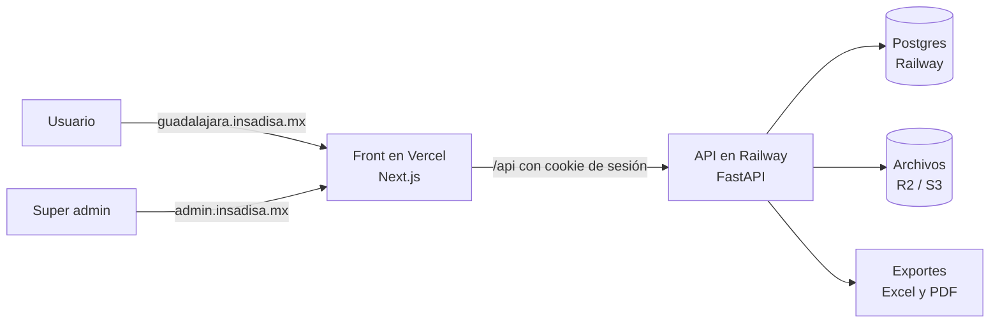
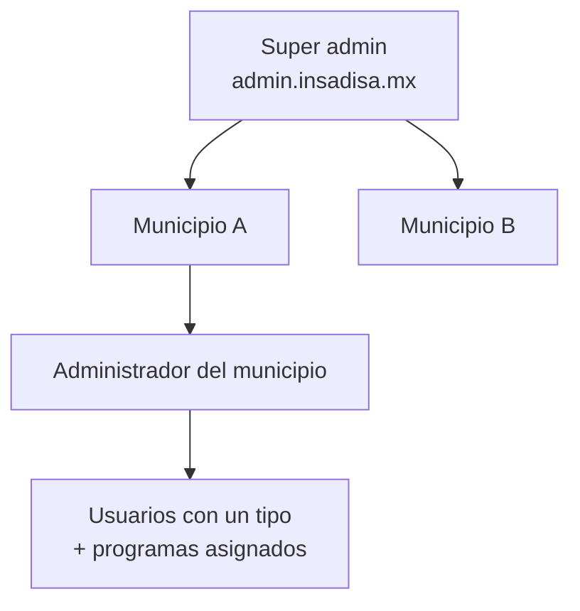

# Panel Indicadores — Documento de producto

Sep 25, 2026 · @santiago

## Resumen y alcance

Construir un sistema propio con las mismas capacidades del panel actual de presupuesto basado en resultados (`demo-indicadores.insadisa.mx`): MIR por programa, captura de avances, Padrón de Beneficiarios, Presupuesto y sus reportes. El comportamiento de referencia está en [Panel Indicadores — Análisis del sistema actual](https://claude.ai/code/artifact/03772fdf-aa72-41a3-ac5f-a2662f1fa752); este documento no lo repite, define cómo se construye.

**Qué cambia respecto al sistema actual**

- **Multi-tenant.** Un solo sistema para varios municipios. Cada municipio tiene su propio subdominio (p. ej. `guadalajara.insadisa.mx`), sus datos, catálogos, usuarios y configuración de login.
- **Super admin.** Un nivel por encima de los municipios que da de alta municipios, los activa o suspende y crea su primer administrador.
- **Los mismos 7 tipos de usuario que hoy.** Al crear un usuario se elige su tipo y se marcan sus programas.
- **Diseño visual.** Se conserva el aspecto del panel actual para que el usuario no note el cambio.

**Supuestos de partida**

- Toda la información se captura a mano en pantalla. No hay carga masiva ni migración desde el sistema actual: cada municipio arranca vacío.
- Lo único que se precarga son catálogos base comunes a todos: clasificador por objeto del gasto (CONAC), frecuencias, dimensiones, algoritmos, grupos de edad, niveles socioeconómicos y geografía (estados, municipios, localidades).
- No hay acceso con admin al sistema actual. Los módulos que solo ve admin se diseñan por inferencia en la última fase.

**Fuera de alcance del MVP**

- Alta de Presupuestación, Cancelación de Padrón, Formato PbR, Clasificación Funcional y Físico Financiero (fase 6).
- Logs MySQL y Panel de control: ningún usuario los tiene asignados hoy; se sustituyen por la bitácora y el panel del super admin.
- Importación de datos desde Excel.

## Arquitectura

| Pieza | Decisión | Por qué |
| --- | --- | --- |
| Front | Next.js en Vercel | Vercel resuelve bien los subdominios comodín y el despliegue. React solo es el motor: el aspecto lo da la hoja de estilos (ver Diseño visual), no una librería de componentes. |
| API | FastAPI en Railway | Tu stack habitual. Concentra reglas de negocio, validaciones, cálculo de cumplimiento y exportes. |
| Base de datos | Postgres en Railway | Todo en un solo proveedor para el backend, mismo esquema que ya usan en el proyecto de Aelika. Cada tabla lleva `municipio_id`. |
| Archivos | Almacenamiento tipo S3 (Cloudflare R2 recomendado) | Documentos de beneficiarios (INE, CURP, comprobantes) e imágenes de login por municipio. |
| Exportes | Excel con `openpyxl`, PDF con HTML→PDF en el servidor | Cuenta Pública, Transparencia, PbR, detalles del padrón; árboles y matrices en PDF. |
| Gráficas | Apache ECharts | El sistema actual usa Highcharts, que requiere licencia comercial. ECharts es gratuita y permite el mismo estilo de pastel y columnas. |

**Cómo se resuelve el municipio en cada petición**

1. DNS comodín `*.insadisa.mx` apuntando a Vercel.
2. El middleware de Next.js lee el subdominio (`guadalajara`) y lo manda a la API en cada llamada.
3. La API busca el municipio por ese `slug`, verifica que esté activo y que el token del usuario pertenezca a ese mismo municipio. Si no coincide, responde 403.
4. `admin.insadisa.mx` queda reservado para el super admin y no resuelve a ningún municipio.

### Autenticación y sesión

El navegador recuerda la sesión: aunque se cierre, el usuario no vuelve a iniciar sesión hasta que la sesión vence.

- **Login:** usuario y contraseña, como hoy. El usuario es único dentro de su municipio, no globalmente. Las contraseñas se guardan cifradas de forma reversible (no con hash), para que el super admin pueda verlas directamente desde el listado de Usuarios — decisión explícita del cliente, con el riesgo documentado en "Riesgos y preguntas abiertas".
- **Duración:** 30 días desde el inicio de sesión. Al vencer, pide login de nuevo. El valor es un parámetro que el super admin cambia desde su panel, sin tocar código ni desplegar.
- **Cómo se guarda:** al iniciar sesión se crea un registro de sesión en la base de datos y el navegador recibe una cookie `httpOnly`, `Secure`, `SameSite=Lax`, con vigencia igual a la duración configurada. Cerrar el navegador o la pestaña no la borra.
- **Aislada por municipio:** la cookie pertenece al subdominio (`guadalajara.insadisa.mx`), no a `.insadisa.mx`. Una sesión de un municipio no sirve en otro ni en el panel del super admin.
- **Mismo dominio para la API:** el front reenvía `/api/*` a Railway, así la cookie es del propio sitio y funciona en Safari y en iPhone, que bloquean cookies de otro dominio.
- **Revocable:** cerrar sesión borra el registro. Deshabilitar un usuario o cambiarle la contraseña cierra todas sus sesiones abiertas. Los permisos se leen de la base de datos en cada petición, así que un cambio de permisos aplica sin volver a iniciar sesión.

**Un usuario pertenece a un solo municipio.** Si una persona trabaja con dos municipios, tiene dos usuarios distintos, uno en cada subdominio.

## Diseño visual

Objetivo: que un usuario del panel actual entre al nuevo y reconozca todo sin capacitación. El sistema actual está hecho con Bootstrap y jQuery; lo que se ve "genérico" en otros proyectos React son las librerías de componentes (shadcn, MUI), no React. Aquí no se usa ninguna de esas.

**Enfoque**

- Hoja de estilos basada en Bootstrap, con los mismos colores, tipografía, espaciados, bordes y sombras del sitio actual. Los componentes se escriben con el marcado de Bootstrap (clases `btn`, `table`, `modal`, `nav-tabs`, `panel`/`card`).
- Misma estructura de pantalla: menú lateral por secciones, barra superior, contenido con buscador + tabla + botones de acción, formularios en ventanas modales, pestañas dentro de Inicio.
- Mismos patrones de interacción: selección múltiple con casillas, deshabilitar/habilitar en lote, confirmación escribiendo "eliminar" en el padrón, íconos de nube para descargas.
- Colores del semáforo verde, amarillo, rojo y gris idénticos a los actuales.

**Cómo se captura la referencia (fase 0)**

1. Recorrer el sitio actual con los usuarios 1, 2 y 3 y tomar capturas de cada pantalla, modal y estado (vacío, con datos, error de validación).
2. Extraer del CSS en uso los valores reales: paleta, fuentes, tamaños, alturas del menú y la barra, estilos de tabla y botón.
3. Dejar esos valores como variables en un solo archivo de tema, y las capturas como galería de referencia para comparar.

**Lo configurable por municipio** (hoy es Configuración → Login): imagen de la pantalla de inicio de sesión, color del botón (7 opciones) y mostrar u ocultar logos. Se agrega el logo del municipio en la barra superior.

**Criterio de aceptación general:** en una comparación lado a lado de la misma pantalla con los mismos datos, la diferencia se limita a textos o logos del municipio.

## Municipios, super admin y usuarios

Hay tres niveles de acceso:

### Super admin

- Alta de municipio: nombre, subdominio, estado de la república por defecto, logo y primer administrador.
- Activar o suspender un municipio. Suspendido = nadie de ese municipio puede entrar; los datos se conservan.
- Mantener las plantillas globales: clasificador CONAC, geografía, frecuencias, dimensiones, algoritmos, grupos de edad y niveles socioeconómicos.
- Ver un tablero con cada municipio: usuarios activos, programas, indicadores y fecha del último acceso.
- No ve ni edita la información operativa de los municipios (indicadores, padrón, presupuesto) desde su panel. La excepción es la carga masiva de datos iniciales, más abajo.
- Cargar datos iniciales en bulk a un municipio a la vez (más abajo).

**Carga masiva desde el super admin.** No está en el MVP, porque toda la captura es manual, pero el modelo ya está pensado para agregarla después sin rediseñar nada: cada tabla del municipio lleva `municipio_id`, así que un importador solo necesita escribir ahí.

1. El super admin elige el municipio destino y el tipo de dato (p. ej. catálogo CONAC, geografía, programas, o incluso beneficiarios si algún día se permite).
2. Sube un Excel o CSV con una plantilla por tipo de dato.
3. El sistema valida cada fila (formato, duplicados, catálogos que no existen) y muestra una vista previa de qué se va a crear o actualizar, sin aplicar nada todavía.
4. Al confirmar, se inserta todo con `municipio_id` de ese municipio, y la bitácora registra qué se cargó, cuándo y por quién.

Es una carga por municipio, nunca a varios a la vez, para no mezclar datos entre tenants por error.

Si la carga incluyera datos personales del padrón, el super admin tendría acceso temporal a esos datos al momento de cargarlos, lo cual rompe el principio de que no ve información de los municipios. Conviene decidir entonces si esa carga la hace el propio municipio (subiendo su Excel desde su rol de Administrador) y el super admin solo la habilita, en vez de que el super admin suba el archivo él mismo.

### Catálogos: globales y del municipio

Al crear un municipio se copian las plantillas globales a su espacio, y a partir de ahí cada municipio edita su propia copia. Así se conserva el comportamiento actual (el usuario de Presupuestación edita partidas y artículos; el del Padrón edita localidades y colonias) sin que un municipio afecte a otro.

| Catálogo | Origen | Quién lo edita en el municipio |
| --- | --- | --- |
| Capítulos, partidas, partidas específicas, artículos | Copia de la plantilla CONAC | Presupuestación, admin |
| Municipios, localidades, colonias | Copia del estado elegido | Padrón, admin |
| Frecuencias, grupos de edad, niveles socioeconómicos | Copia de la plantilla | Admin (y Alcalde para frecuencias) |
| Centros gestores, ejes, subtemas, estrategias, programas | Vacíos | Alcalde, admin (programas también Presupuestación) |
| Apoyos y descripciones de apoyo | Vacíos | Padrón, admin |

### Tipos de usuario

Al crear un usuario se elige **un tipo** de una lista fija de 7. El tipo define qué módulos ve y qué puede hacer en cada uno; no se editan permisos casilla por casilla. Los tipos replican los perfiles del sistema actual (detalle módulo por módulo en la matriz del [análisis del sistema actual](https://claude.ai/code/artifact/03772fdf-aa72-41a3-ac5f-a2662f1fa752)).

| Tipo | Qué ve y hace |
| --- | --- |
| 1 · Informes | Inicio completo · catálogos MIR en consulta · Usuarios · 6 estadísticas de indicadores · Configuración (Login y Meses de avances) |
| 2 · Padrón de Beneficiarios | Padrón (consultar y eliminar) · 8 catálogos del padrón · Usuarios · 4 estadísticas del padrón |
| 3 · Presupuestación | Inicio con Presupuestación · Programas con duplicar · capítulos, partidas, partidas específicas y artículos · Usuarios · Techo Presupuestal · Dependencias y PbR |
| 4 · Control Presupuestal | Inicio con Presupuestación · Físico Financiero |
| 5 · Indicadores | Inicio con Presupuestación · Usuarios |
| 6 · Alcalde | Inicio con Presupuestación · catálogos MIR con edición · Usuarios · 6 estadísticas + Físico Financiero · Formato PbR · Meses de avances |
| 7 · Administrador | Todo |

**Además del tipo, cada usuario tiene sus programas.** Dos usuarios del mismo tipo pueden trabajar programas distintos: hoy el usuario 1 tiene 8 programas y el 2 solo uno. Al crear el usuario se marcan sus programas en un árbol agrupado por centro gestor, y solo esos aparecen en sus selectores y reportes.

- **Datos del usuario:** nombre, usuario, contraseña, tipo, programas, dirección, teléfono, email, años de acceso, meses de acceso y activo.
- **Cambiar de tipo** a un usuario le cambia el acceso en su siguiente petición, sin volver a iniciar sesión.
- **El menú se arma según el tipo,** y la API revisa tipo y programa en cada petición. Ocultar un módulo en el menú no basta.
- **Quién crea usuarios:** solo el Administrador del municipio. Los otros 6 tipos no ven el módulo de Usuarios.

#### Matriz de usuarios y programas

Pantalla para asignar programas a muchos usuarios de una vez, además del árbol dentro del formulario de cada usuario.

- **Filas:** usuarios, con su tipo al lado. **Columnas:** programas del ejercicio elegido, agrupados bajo el encabezado de su centro gestor.
- **Una casilla por cruce.** Marcada = el usuario ve y trabaja ese programa.
- **Atajos en lote:** marcar o desmarcar una fila completa (todos los programas a un usuario), una columna (un programa a todos), o un grupo de centro gestor para uno o varios usuarios seleccionados.
- **Filtros:** ejercicio, centro gestor, tipo de usuario y búsqueda por nombre, para no trabajar con la matriz completa.
- **Guardado explícito:** los cambios se marcan en la pantalla y se aplican con un botón Guardar que muestra el resumen ("12 asignaciones nuevas, 3 retiradas"). Queda en bitácora.

#### Alta de varios usuarios a la vez

- Tabla editable con una fila por usuario nuevo: nombre, usuario, email, tipo y contraseña inicial (o generada). Se agregan filas con un botón o pegando desde Excel.
- Al guardar se validan todas las filas (usuario repetido, email inválido, tipo no permitido) y se señalan las que fallan sin perder las demás.
- Los usuarios creados aparecen de inmediato en la matriz para asignarles programas.
- El usuario cambia su contraseña inicial en su primer inicio de sesión.

**Nivel de acceso por programa.** Hoy no existe: la asignación de un programa es sí o no. Lo que el usuario puede hacer (consultar o editar) lo define su tipo y es igual en todos sus programas. No se puede, por ejemplo, editar el programa A y solo consultar el B. El sistema nuevo replica eso; la matriz queda preparada para agregar un nivel por casilla si más adelante se necesita.

**Resuelto: cómo se crea cada nivel.** El super admin no se crea desde ninguna pantalla: se inserta directo en la base de datos (seed), fuera de la interfaz. Al dar de alta un municipio, el super admin crea su primer Administrador (ver sección Super admin, arriba). Dentro del municipio, solo ese Administrador crea a los demás usuarios, incluido otro Administrador.

## Modelo de datos

Parte del modelo inferido en el análisis, con el municipio como dueño de todo.

| Grupo | Tablas | Dueño |
| --- | --- | --- |
| Plataforma | municipio, super\_admin, plantillas globales (CONAC, geografía, catálogos fijos) | Global |
| Acceso | usuario (con tipo), usuario\_programa, sesion, bitácora | Municipio |
| Planeación | centro\_gestor, eje, subtema, estrategia, frecuencia, programa | Municipio |
| MIR | arbol\_causa\_medio, arbol\_efecto\_fin, elemento\_matriz, indicador, meta\_anual, avance\_mensual | Municipio |
| Presupuesto | capitulo, partida, partida\_especifica, articulo, techo, techo\_partida, asignacion\_actividad, asignacion\_articulo (12 montos) | Municipio |
| Padrón | beneficiario, documento, apoyo, descripcion\_apoyo, entrega, nivel\_socioeconomico, grupo\_edad, municipio\_geo, localidad, colonia | Municipio |
| Configuración | config\_municipio (login, meses de avances, tolerancia) | Municipio |

**Reglas del modelo**

- Todas las tablas del municipio llevan `municipio_id`, y la API filtra por él en cada consulta. Ninguna consulta de negocio se escribe sin ese filtro; se aplica en una capa común, no endpoint por endpoint.
- Las claves son únicas dentro del municipio: `(municipio_id, clave)`. La CURP es única por municipio.
- Catálogos MIR y programas se deshabilitan, no se borran (como hoy). Catálogos del padrón y de presupuesto sí se borran, pero solo si nada los usa.
- La entrega guarda edad, grupo de edad y nivel socioeconómico del momento, no una referencia viva.
- El cumplimiento de un indicador se calcula en la API a partir de las sumatorias de A y B y del algoritmo; no se captura.
- Montos en `numeric(14,2)`, nunca en flotante.
- Bitácora: quién, cuándo, qué registro y qué cambió, para toda alta, edición, baja y exportación.

## Fases

Cada fase se entrega desplegada y usable en un municipio de prueba (`demo.insadisa.mx`). Las pruebas que aplican a todas: pruebas automáticas de la API (reglas y validaciones), una prueba de aislamiento entre dos municipios y la comparación visual contra las capturas de referencia.

**Método de paridad:** se captura el mismo programa de ejemplo en el sistema actual y en el nuevo, y se comparan cálculos y exportes. Es la forma de medir que "hace lo mismo".

| Fase | Contenido | Depende de |
| --- | --- | --- |
| 0 | Base: referencia visual, infraestructura, municipios y super admin | — |
| 1 | Acceso y planeación: sesión, usuarios y tipos, catálogos MIR, configuración | 0 |
| 2 | MIR: árbol, matriz, indicadores y captura de avances | 1 |
| 3 | Estadísticas de indicadores y exportes oficiales | 2 |
| 4 | Presupuesto: clasificador, techo, presupuestación y PbR | 2 |
| 5 | Padrón de beneficiarios | 1 |
| 6 | Módulos diseñados por inferencia | 3, 4, 5 |

### Fase 0 — Base

- **Alcance:** galería de capturas y archivo de tema del sitio actual; repos y despliegue en Vercel y Railway; subdominio comodín; resolución del municipio por subdominio; login; panel del super admin con alta, suspensión y primer administrador; carga de plantillas globales y su copia al crear un municipio; menú lateral y barra superior vacíos con el aspecto final.
- **Aceptación:** dar de alta "demo" desde el super admin deja `demo.insadisa.mx` funcionando con su administrador y sus catálogos copiados. Un subdominio inexistente o suspendido muestra una página de error, no un login. El login y el cascarón se ven igual que el actual.
- **Prueba:** crear dos municipios; un token del municipio A llamando con el subdominio de B recibe 403.
- **Medición:** tiempo de alta de un municipio nuevo (meta: menos de 5 minutos, sin tocar código ni DNS).

### Fase 1 — Acceso y planeación

- **Alcance:** sesión persistente con duración configurable; usuarios (alta, edición, deshabilitar, años y meses de acceso); 7 tipos de usuario; matriz de usuarios × programas con asignación en lote; alta de varios usuarios a la vez; centros gestores, ejes, subtemas, estrategias, frecuencias y programas con duplicar a otro ejercicio; configuración de login y meses de avances.
- **Aceptación:** un usuario de cada tipo ve el mismo menú que su perfil equivalente actual; cambiar el tipo cambia el acceso en la siguiente petición; un usuario solo ve sus programas en todos los selectores; tras cerrar y reabrir el navegador la sesión sigue activa, y al vencer pide login; deshabilitar un usuario lo saca de inmediato; duplicar un programa lo copia al ejercicio destino con clave nueva; deshabilitar no borra.
- **Prueba:** un caso por tipo que verifica menú y acceso directo por URL a un módulo no permitido (debe negarse en la API); una prueba con la duración de sesión puesta en minutos para comprobar el vencimiento; una prueba de que la cookie de un municipio no abre otro.
- **Medición:** 7 de 7 tipos con menú idéntico al del perfil actual; cero accesos a módulos sin permiso en las pruebas.

### Fase 2 — MIR

- **Alcance:** árbol de problemas y objetivos (causas ↔ medios, efectos ↔ fines, 2 niveles); matriz con Fin, Propósito, Componentes y Actividades; indicador con ficha técnica, metas por año y rangos del semáforo; captura mensual de A y B con sumatorias y cumplimiento; respeto de meses activos y tolerancia; descargas de árboles y matrices.
- **Aceptación:** los 4 algoritmos calculan igual que el sistema actual; con algoritmo `A` se bloquea B; no se pueden capturar metas sin algoritmo y frecuencia; un mes inactivo no se puede capturar; el color del cumplimiento sigue los rangos del indicador.
- **Prueba:** capturar el indicador de Fin de "Fortalecimiento del empleo" con los mismos valores que tiene hoy y obtener cumplimiento 2024 = 1.18.
- **Medición:** 100% de coincidencia en cumplimiento para el programa de paridad.

### Fase 3 — Estadísticas de indicadores

- **Alcance:** Dependencias, Ejes (semaforización), Cumplimiento de Metas, Consolidado, Cuenta Pública (38 columnas, confirmadas con un Excel de muestra) y Transparencia (26 columnas, confirmadas con un Excel de muestra), con los dos tipos de cumplimiento y exportación a Excel.

  **Columnas confirmadas de Cuenta Pública** (agrupadas igual que en el Excel de muestra):
  - *Programa o proyecto de inversión:* Año, Ejercicio fiscal, Clasificación del programa presupuestario, Clave del programa presupuestario, Nombre del programa presupuestario, Clasificación funcional del gasto, Nombre de la dependencia o entidad que lo ejecuta.
  - *Presupuesto del programa presupuestario:* Aprobado, Modificado, Devengado, Ejercido, Pagado.
  - *MIR:* Cuenta con MIR (SI/NO), Nivel de la MIR del programa, Descripción del resumen narrativo (Fin, Propósito, Componentes y Actividades).
  - *Indicadores:* ID del indicador, Nombre del indicador, Nivel de la MIR al que corresponde, Fórmula de cálculo, Descripción de variables de la fórmula, Meta programada, Meta modificada, Meta alcanzada, Avance/Programado, Unidad de medida, y un valor por cada mes de enero a diciembre.

  **Columnas confirmadas de Transparencia:** Título, Nombre Corto y Descripción del reporte; después Ejercicio, Fecha de inicio y fin del periodo informado, Nombre del programa, Objetivo institucional (resumen narrativo), Nivel de la MIR, ID y Nombre del indicador, Dimensión a medir, Definición del indicador, Algoritmo, Método de cálculo, Unidad de medida, Frecuencia de medición, Año y Valor de línea base, Meta programada del año (con descripción), Meta ajustada, Avance de metas, Sentido del indicador, Fuente de información, Fecha de validación, Área responsable y Fecha de actualización, y Nota.

  **Con qué se probó y qué confirma:**
  - El primer par de exportes (programa sin captura en 2026) confirmó el formato de columnas.
  - Un segundo par con datos reales (2024) confirmó además el cálculo: Cuenta Pública trae cada indicador en dos filas HTML, una por variable (A y B), cada una con sus 12 meses; la meta programada, modificada, alcanzada y el avance son del indicador completo, no de la variable, y se comparten entre las dos filas (`rowspan`). Ejemplo verificado: programa 1017 (Pobreza y desarrollo social), indicador 416, algoritmo `A`: suma de la variable A en el año (15+15+32+25+18 = 105) = Meta alcanzada (105.00) = Avance/Programado (105). Confirma que con algoritmo `A` el cumplimiento es la sumatoria directa de A, tal como está en el modelo de este documento.
  - Transparencia trae una sola fila por indicador (no por variable), con las 26 columnas ya documentadas arriba.

  **Sigue pendiente:** el Excel de muestra de PbR, y las gráficas de Dependencias, Ejes, Cumplimiento de Metas y Consolidado.
- **Aceptación:** con los mismos datos, las gráficas y conteos coinciden con el sistema actual, salvo por el alcance (siguiente punto); los Excel de Cuenta Pública y Transparencia tienen las mismas columnas, en el mismo orden, que los archivos de muestra.

  **Resuelto: alcance por programas del usuario, no toda la dependencia.** En el sistema actual, Dependencias, Cumplimiento de Metas y Consolidado cuentan los indicadores de **todos** los programas de la dependencia elegida, aunque el usuario solo tenga asignado uno de ellos (comprobado en vivo: la dependencia Económico solo tiene el programa "Fortalecimiento del empleo" asignado al usuario 1, pero el semáforo trae los 19 indicadores de toda la dependencia). En el sistema nuevo, las cuatro estadísticas de indicadores (Dependencias, Ejes, Cumplimiento de Metas y Consolidado) cuentan **solo los programas asignados al usuario**, igual que ya funciona en Inicio y en el resto del sistema. El selector de centro gestor/eje sigue limitado a las dependencias donde el usuario tiene al menos un programa, pero dentro de esa dependencia el conteo se filtra también por programa.
- **Prueba:** comparar celda por celda el Excel generado contra el de muestra bajado del sistema actual.
- **Medición:** cero diferencias de columnas; diferencias de valores explicadas o cero.

### Fase 4 — Presupuesto

- **Alcance:** capítulos, partidas, partidas específicas y artículos; techo presupuestal por centro gestor y ejercicio con reparto por partida y estado abierto/cerrado; pestaña Presupuestación en Inicio con asignación por actividad y artículo mes a mes; reporte PbR con exportación.
- **Aceptación:** el techo exige monto > 0, al menos una partida, sin repetir y con suma igual al total; una asignación no puede exceder lo que queda por distribuir de su partida; la pestaña solo aparece si el programa tiene techo y el usuario tiene el permiso.
- **Prueba: resuelta con el Excel de muestra del PbR** (programa 2076 Comedores Comunitarios, ejercicio 2076). Confirma exactamente el ejemplo que ya teníamos documentado: Fin y Propósito con su resumen narrativo; Componente 1 con los $100 totales; las tres actividades con $45, $35 y $20; y dentro de cada actividad, la partida específica 2213 (Productos alimenticios) y 2231 (Utensilios) desglosadas por artículo con montos mes a mes (todo cargado en enero, el resto de los meses en 0) y su total. Confirma también el encabezado exacto: Programa, Centro Gestor, Fecha de Elaboración, Ejercicio Fiscal, Clasificación Funcional y Alineación al Programa (Eje, Subtema, Estrategia).
- **Medición:** PbR idéntico en estructura y totales al del sistema actual.

### Fase 5 — Padrón de beneficiarios

- **Alcance:** beneficiarios con validación de CURP contra fecha de nacimiento, domicilio y documentos adjuntos; apoyos, descripciones, grupos de edad, niveles, geografía; captura de entregas con capturas del día y borrado confirmado; 4 estadísticas del padrón con exportes.
- **Aceptación:** la edad asigna el grupo de edad automáticamente; solo aparecen apoyos del programa elegido; la entrega guarda la foto del momento; el reporte de documentos lista a quien le falte cada tipo.
- **Prueba:** capturar el mismo lote de entregas en ambos sistemas y comparar el Top 5 de localidades y las gráficas.
- **Medición:** tiempo para capturar una entrega de un beneficiario existente igual o menor que hoy.

### Fase 6 — Módulos por inferencia

- **Resuelto: se muestran deshabilitados, no ocultos.** Formato PbR, Alta de Presupuestación, Cancelación de Padrón, Clasificación Funcional y Físico Financiero aparecen en el menú lateral desde la fase 0, pero sin funcionalidad (deshabilitados o con aviso de "próximamente") hasta que se construyan en esta fase. Así el menú se ve completo desde el inicio y no hay que reordenar nada después.
- **Antes de construir:** una mini especificación por módulo, validada con el cliente, porque no hay referencia del sistema actual.
- **Aceptación y medición:** se definen en esa especificación.

## Riesgos y preguntas abiertas

| Tema | Riesgo o pregunta | Qué hacer |
| --- | --- | --- |
| Dominio | Resuelto: se compra un dominio propio (no `insadisa.mx`) para tener control total del DNS y de los subdominios comodín. | Comprar el dominio y apuntar sus nameservers a Vercel en la fase 0. |
| Formatos oficiales | Resuelto: se bajaron y revisaron los Excel de muestra de Cuenta Pública y Transparencia (38 y 26 columnas respectivamente); quedan documentados en la fase 3. Falta el de PbR y falta un caso con datos capturados para comparar valores, no solo columnas. | Bajar un Excel de muestra de cada uno con los usuarios 1 y 3 (no requiere admin). |
| Datos personales | El padrón guarda CURP, domicilio e identificaciones. Los municipios son sujetos obligados en materia de protección de datos. | Documentos en almacenamiento privado con enlaces temporales, acceso solo con permiso, bitácora de consultas y exportes, aviso de privacidad por municipio. Validarlo con el área jurídica del cliente. |
| Ubicación de los datos | Resuelto: se aloja igual que el resto de la infraestructura de Aelika, sin requisito de estar en México. | Si algún municipio pide lo contrario más adelante, la arquitectura permite mover la base de datos sin rediseñar nada. |
| Validaciones del servidor | Del sistema actual solo vimos las validaciones del navegador. | Cubrirlas con pruebas de API y con el método de paridad. |
| Normativa | Los lineamientos de MIR, CONAC y transparencia cambian con el tiempo. | Definir quién da mantenimiento normativo y cómo se actualizan plantillas en municipios existentes. |
| Contraseñas visibles | Decisión explícita del cliente: el super admin y el Administrador de municipio ven las contraseñas de los usuarios en texto plano desde el listado de Usuarios. Esto exige guardarlas cifradas de forma reversible en vez de con hash (se abandona argon2). Si la base de datos se filtra, se exponen las contraseñas reales de todos los municipios, y si un usuario reutiliza esa contraseña en otro sitio, también queda expuesta ahí. | Aceptado así por el cliente. Mitigar con cifrado en reposo, acceso a la función restringido y con bitácora, y recomendar a los municipios no reutilizar contraseñas. |

**Preguntas para cerrar**

- **Primer municipio: resuelto.** Es el mismo demo al que ya tenemos acceso (`demo-indicadores.insadisa.mx`), aparentemente una copia del municipio Apaseo El Alto. Sirve como dato de referencia para las pruebas de paridad de todas las fases.

**Decisiones de usuarios y acceso**

- **Quién crea a quién:** resuelto arriba, en "Municipios, super admin y usuarios". El super admin viene de un seed en base de datos; crea el primer Administrador de cada municipio; dentro del municipio, solo el Administrador crea a los demás usuarios.
- **Vencimiento de sesión:** confirmado, 30 días fijos desde el login, sin renovarse con el uso.
- **Recuperar contraseña:** el super admin y el Administrador del municipio ven la contraseña de cualquier usuario directamente en el listado de Usuarios (no solo la pueden forzar). Además, el propio usuario puede pedir un enlace por email que vence en 1 hora para cambiarla él mismo.
- **Soporte del super admin:** no hay "entrar como" (nunca toma la sesión de un usuario existente sin su contraseña). Cuando un municipio necesita ayuda, usa la misma capacidad de gestión de usuarios que ya tiene: crea un usuario nuevo en ese municipio, o le fuerza una contraseña nueva a uno existente (ver "Recuperar contraseña", arriba). No es una función aparte, es la misma herramienta aplicada cuando hace falta soporte.
