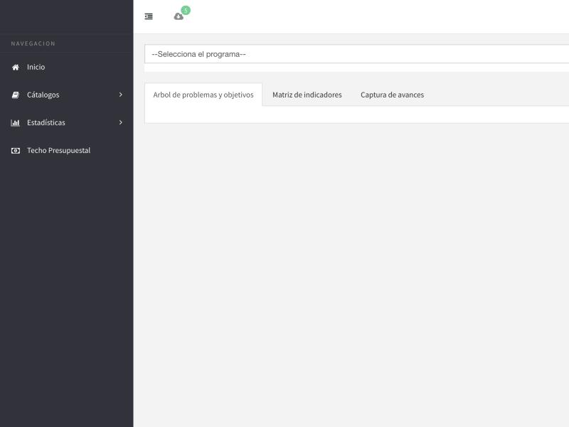
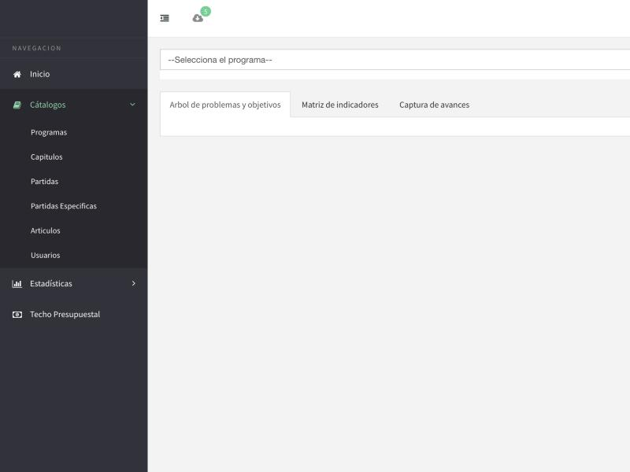
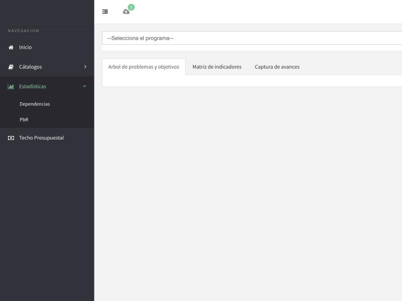
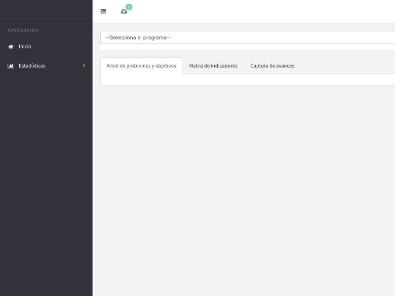

# Panel Indicadores — Especificación de diseño: Cascarón y navegación

Oct 1, 2026

## Resumen

Este documento define el lenguaje visual del cascarón (menú lateral + header) que debe ser **idéntico** entre el panel de super admin (`/front/app/sa/`) y el panel de municipio (`/front/app/mun/`) del proyecto Indicadores. Se basa en capturas reales tomadas el 2026-10-01 del sistema de referencia (demo-indicadores.insadisa.mx, municipio Apaseo el Alto) con dos tipos de usuario distintos: **usuario 3 (Presupuestación)** y **usuario 4 (Control Presupuestal)**.

La única diferencia permitida entre paneles es **qué opciones de menú aparecen** según el tipo de usuario o ámbito (super admin vs. municipio). El cascarón en sí — colores, tipografía, iconografía, espaciados, estados activo/hover, comportamiento de expansión — debe sentirse exactamente igual.

## Estructura general

El cascarón tiene tres zonas fijas, presentes en toda pantalla autenticada:

1. **Menú lateral** (izquierda, ancho fijo ~186px) — fondo oscuro, siempre visible, colapsable con el icono hamburguesa del header.
2. **Header** (franja superior, fondo blanco) — icono de colapsar menú, icono de notificaciones, y a la derecha el nombre/rol del usuario autenticado.
3. **Área de contenido** (fondo gris claro) — aquí vive lo que cambia pantalla a pantalla: selector de programa, tabs, tablas, formularios.

Esta división de tres zonas es la que debe repetirse sin cambios entre `/sa/` y `/mun/`; solo el contenido de la zona 3 y las opciones dentro del menú lateral cambian.

## Menú lateral

| Elemento | Especificación |
| --- | --- |
| Fondo | Azul-gris muy oscuro, casi negro (tipo `#2b2e38`–`#30333d`), sólido, sin degradado |
| Encabezado "NAVEGACION" | Texto pequeño, mayúsculas, gris tenue, funciona como etiqueta de sección, no es clickeable |
| Item de primer nivel | Icono + texto en una fila, texto gris claro/blanco, padding generoso (fila alta, fácil de tocar) |
| Item con submenú | Lleva un chevron (`>`) a la derecha; al hacer click expande el submenú y el chevron rota hacia abajo (`v`) |
| Item o sección activa/expandida | Icono y texto cambian a un **verde menta** de acento (`#6fcf97` aprox.); es el único color de acento en todo el menú |
| Items de submenú | Sin icono propio, indentados respecto al item padre, mismo tono de texto que los de primer nivel, fondo ligeramente más oscuro que el resto del menú |
| Iconografía | Set de línea simple (outline), un icono por item de primer nivel (casa=Inicio, libro=Catálogos, gráfica de barras=Estadísticas, cámara/moneda=Techo Presupuestal) |
| Comportamiento | Un solo submenú puede estar expandido a la vez o varios simultáneo (verificar con Claude Code cuál de los dos aplica); el menú completo colapsa a solo-iconos o se oculta con el botón hamburguesa del header |

Ver las capturas más abajo para el estado expandido de "Catálogos" y "Estadísticas".

## Header

Franja blanca, fina, de ancho completo, con tres elementos:

- **Izquierda**: icono hamburguesa (líneas horizontales) para colapsar/expandir el menú lateral.
- **Centro-izquierda**: icono de notificaciones (nube/campana) con un badge circular verde mostrando un conteo (ej. "5").
- **Derecha**: etiqueta con el número y nombre del tipo de usuario actual (ej. "3.- PRESUPUESTACION", "4.- CONTROL PRESUPUESTAL") seguida de un chevron hacia abajo que abre un dropdown (probablemente con la opción de cerrar sesión).

El header no cambia de contenido entre pantallas; es fijo en toda la sesión autenticada.

## Comportamiento por tipo de usuario

Las capturas confirman en vivo lo que ya definía la Fase 1: el menú lateral muestra solo las opciones a las que ese tipo de usuario tiene acceso.

| | Usuario 3 — Presupuestación | Usuario 4 — Control Presupuestal |
| --- | --- | --- |
| Items de menú | Inicio, Catálogos (6 subitems), Estadísticas (2 subitems), Techo Presupuestal | Inicio, Estadísticas |
| Submenú Catálogos | Programas, Capitulos, Partidas, Partidas Especificas, Articulos, Usuarios | (no aplica) |
| Submenú Estadísticas | (no explorado para este usuario) | Dependencias, PbR |

**Qué cambia**: la lista de items visibles y sus submenús, según los permisos del tipo de usuario (ya documentado en la tabla de 7 tipos de usuario de la Fase 1).

**Qué nunca cambia**: el estilo visual de cada item (icono+texto, indentado, colores de estado), el comportamiento de expansión, el header, y el orden relativo de las secciones.

Esto aplica igual para el panel de super admin: sus propias opciones (gestión de municipios, plantillas, etc.) deben insertarse en un menú con exactamente este mismo lenguaje visual, no uno nuevo.

## Capturas de referencia

Tomadas en vivo el 2026-10-01 en demo-indicadores.insadisa.mx.

Usuario 3 — Presupuestación, menú cerrado.

Usuario 3 — submenú "Catálogos" expandido: icono y texto en verde menta, items hijos indentados sin icono.

Usuario 3 — submenú "Estadísticas" expandido (Dependencias, PbR).

Usuario 4 — Control Presupuestal: mismo cascarón, menú reducido a solo Inicio y Estadísticas según su permiso.

## Checklist de paridad

- [ ] El menú lateral de `/sa/` y de `/mun/` usan el mismo componente/patrón visual (mismo fondo oscuro, misma tipografía, mismo acento verde menta para activos)
- [ ] Los items de menú en ambos paneles siguen el mismo patrón icono+texto con el mismo set de iconos de línea
- [ ] El comportamiento de expandir/colapsar submenús es idéntico en ambos paneles
- [ ] El header (hamburguesa, notificaciones, usuario+dropdown) es idéntico en posición y estilo en ambos paneles
- [ ] Las únicas diferencias entre `/sa/` y `/mun/` están en qué items de menú existen, nunca en cómo se ven
- [ ] El menú de cada tipo de usuario dentro de `/mun/` muestra solo sus opciones permitidas (tabla de 7 tipos, Fase 1), replicando lo observado en las capturas de usuario 3 y usuario 4

Si hoy existen dos implementaciones visuales divergentes del cascarón entre ambos paneles, ese es el hallazgo a reportar y resolver primero.

---

Doc completo (editable, con comentarios): https://claude.ai/artifact/LDvTcobWW3bszsA16z1DU1
